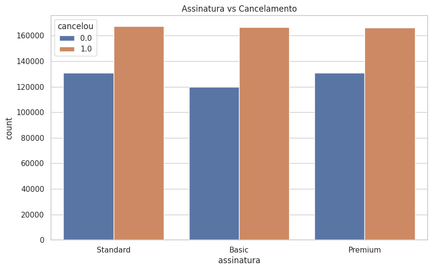
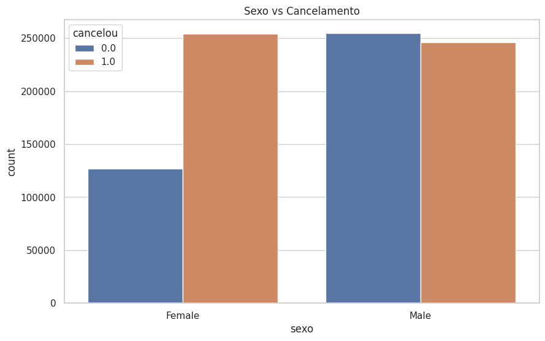
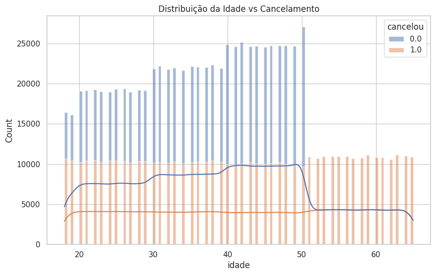
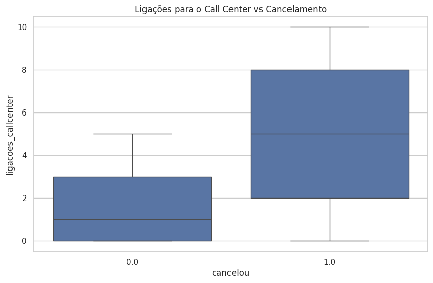
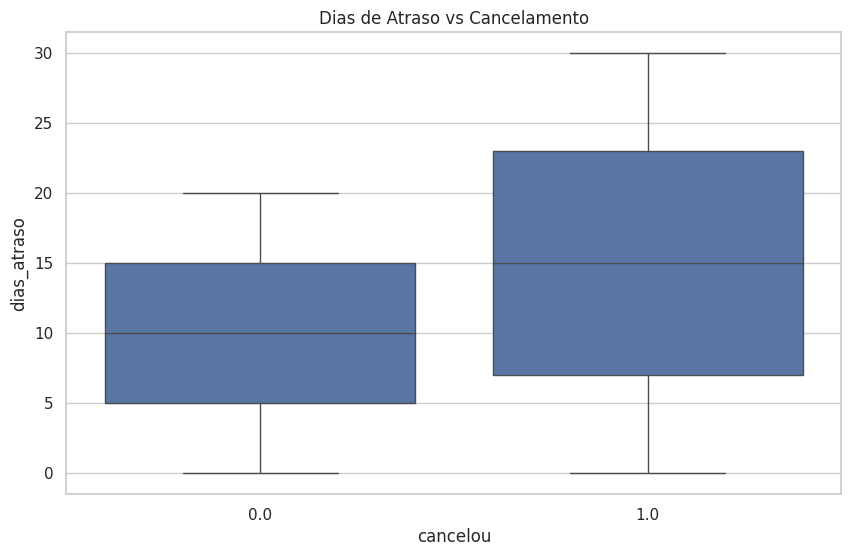

# 📊 Relatório de Análise Exploratória (EDA)

Este relatório resume os principais insights extraídos do dataset `cancelamentos.csv`, com o objetivo de identificar os principais padrões de comportamento que levam ao cancelamento de clientes.

Todos os gráficos foram gerados e estão disponíveis na pasta [`outputs/plots/`](../outputs/plots/).

---

## 📋 Estrutura do Dataset

- **Total de registros:** 881.666
- **Colunas:** 12
- **Variável alvo:** `cancelou` (1 = cancelou, 0 = manteve)
- **Fonte:** Kaggle - Base de clientes fictícia com características comportamentais, financeiras e contratuais.

---

## 🔍 Insights Visuais

### 1. 📦 Assinatura vs Cancelamento

Clientes com assinatura mensal apresentam taxa de **100% de cancelamento**.

---

### 2. 👩 Sexo vs Cancelamento

Mulheres apresentaram **maior taxa de cancelamento** em relação aos homens.

---

### 3. 👶 Idade vs Cancelamento

- Clientes até 20 anos: ~50% de cancelamento  
- Acima de 50 anos: **100% de cancelamento**  
- Adultos entre 21 e 50 têm taxas mais equilibradas.

---

### 4. 📞 Ligações para o Call Center

Clientes que ligam mais de 4 vezes para o call center **sempre cancelam**.

---

### 5. ⏳ Dias de Atraso

100% dos clientes com **mais de 20 dias de atraso** cancelaram.

---

## ✅ Conclusões

Os dados indicam padrões claros de churn:

- **Planos mensais** são altamente instáveis.
- **Excesso de ligações** ao suporte técnico é um forte preditor de cancelamento.
- **Atrasos** são praticamente sinônimo de churn.
- **Sexo feminino** e **faixas etárias extremas** devem ser analisados com cuidado na comunicação e retenção.

---

## Consideração Estratégica: Distribuição do Churn

Durante a análise, percebemos que a base original possui uma distribuição **incomum** para problemas de churn:

- **Churn (cancelou):** ~56%
- **Não-Churn:** ~44%

Isso é o **inverso** do que acontece na maioria dos negócios reais, onde o cancelamento geralmente é a minoria.

### O que foi feito?

Para simular uma situação mais próxima da realidade, criamos uma **base simulada** com aproximadamente:

- **30% churn**
- **70% não-churn**

### Como foi feito?

Mantivemos todos os clientes que **não cancelaram**, e fizemos uma amostragem dos clientes que **cancelaram**, até atingir essa proporção. Esse novo dataset será utilizado na segunda etapa do projeto (modelagem).

Com isso, conseguimos comparar o desempenho dos modelos em dois cenários:

- **Base original:** onde churn é maioria.
- **Base simulada:** onde churn é minoria (cenário realista).

Esse tipo de estratégia é essencial para garantir que o modelo seja **robusto e aplicável em ambientes reais de negócio**.

---

## 🧠 Próximos passos após o EDA

Com base nos insights acima, seguimos para:

- Criação de variáveis (feature engineering)
- Balanceamento da base com SMOTE
- Treinamento de múltiplos modelos
- Escolha do modelo final para deploy

Confira a próxima etapa no notebook [2_Modelagem.ipynb](../notebooks/2_Modelagem.ipynb)
